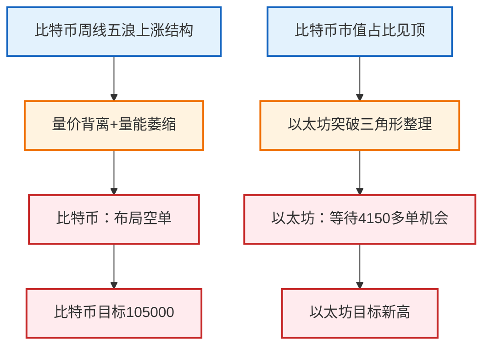

# 比特币暴跌，最重要的点在哪里？

## 视频来源

https://www.bilibili.com/video/BV1UAYWz5E36?p=1

## 总结

## 首席金融分析师

### 1. 研报摘要
- **讲座主题**：比特币与以太坊2025年8月技术分析与交易策略
- **核心判断**：比特币周线级别多头衰竭，看空至105000；以太坊结构健康，等待4150附近布局多单
- **置信度/情绪**：**强烈看空比特币**/**谨慎看多以太坊**

### 2. 宏观传导机制

### 3. 资产配置观点

| 资产类别 | 观点 | 核心逻辑摘要 | 关注点位 |
| --- | --- | --- | --- |
| **比特币** | 🔴 强烈看空 | 周线量价背离，日线反转信号，趋势线破位 | 空单入场117900，目标112000/105000 |
| **以太坊** | 🟢 谨慎看多 | 突破三角形整理，结构健康，等待回踩支撑 | 多单触发位4150，止损4000下方 |
| **比特币/以太坊比率** | 🔴 看空 | 比特币市值占比见顶，资金可能轮动至以太坊 | - |

### 4. 关键数据与证据
* **比特币技术指标**：
  - 当前价格：117900
  - 关键支撑：115700（即时）、112000（前高）、105000（终极目标）
  - 阻力位：124400（半年强阻）
* **以太坊技术指标**：
  - 突破位：4100（周线级别）
  - 回踩支撑：4150-4200（与4小时0.618-0.5回撤位重合）
  - 上方目标：4868（历史前高）

### 5. 风险与不确定性
* **比特币风险**：
  - 假突破风险（若快速收复115700并突破124400将破坏空头逻辑）
  - 黑天鹅：SEC突然批准比特币ETF可能引发轧空
* **以太坊风险**：
  - 灰犀牛：若比特币暴跌至10万以下可能拖累以太坊跌破4000
  - 流动性风险：AG缺口（约4100）可能引发程序化卖盘
* **反向思考**：
  - 若以太坊未能守住4150，可能预示整个加密货币市场进入熊市
  - 比特币若在105000出现"投降式抛售"，可能是长线抄底机会

大家早上好，今天是2025年8月18号上午10点20分，我是**比特币K哥**。今天我们一起来看一下比特币的盘面。

首先我们看到周线级别，这是一个完整的五浪上涨的**多头结构**。这个多头结构目前应该来到了一个末端。为什么这么讲呢？大家看一下最后这段上涨过程中：

- 它的**量价**持续在背离；
- 量能持续在减少；
- 价格不断创出新高。

这标志着周线即将进入一个**多头衰竭**的阶段。我们可以得出两个结论：

1. 现在不是拿中长线多单的时候；
2. （此处根据语义判断原文未完，保留原文结构）

第二。

我们应该在找位置布局一笔空单。至于为什么要布局空单，我们来看一下 **日线**。

在8月14号，8月14号收的这根大阴线把前面这三根K线都吞没了，这就是一个 **反转信号** 了。

**反转信号**了。日线昨天在经过3天的盘整之后。

在这个连续收了大阴线之后，连续三根横盘，这是一个很弱势的表现。我们昨天自己的空单大概是在 **117900** 附近做进去的，目前还在持有当中。

那有人问：你这个空单看到哪里？

现在这个行情的话，首先第一，我们看一下。最重要的一个支撑其实现在已经到了，我们要观察在这个位置的价格反应：**115700**。

在这里，如果说没有太多的买盘力量把这个地方撑住的话，一旦破位——我们去看一下这个趋势线——从今年4月份以来的这波上涨，**趋势线**上面其实已经破位了。

我们的第一目标是看到这个底部，**112000**左右。

112000多，这是前面的一个日线级别的前高位置。前高位置附近到这个地方一定会有反应的。

如果说价格来到这个位置，没有直接跌破。

这个地方我刚说过了，肯定会有反应的对吧？这个位置的反弹能到多远，不清楚。如果在反弹过程中出现弱势，我们肯定要布局空单。

**K哥**主观上认为这一笔下跌在这个位置是止不住的。它可能在中间会盘整下跌，我觉得这个地方是一个中继。我们的第一目标首先看到**1005000****。比特币**一旦到达**1005000** 这个位置...

如果开启反弹，其实我更建议大家去拥抱 **以太坊**。至于为什么，我们待会讲到以太坊时再说。

那有的小伙伴说，我这个地方短线能不能做空呢？我们来看一下1小时级别。**短线不能追空**，这是双底的颈线位。

那这个地方双底的一个颈线位，这个位置希望大家不要在这里轻易去追空。如果说它在这个地方价格有反应，有所反弹的话，那如果这个反弹比较弱势，并且出现了反转信号，那这个位置你是可以去做一笔空单的。

好，这是 **比特币**。

在这个位置，一旦形成假突破，那将 **非常危险**。

这个地方形成假突破之后，你想去解套，就算它后面到了1000。比如说这些位置，它还有所反弹，**仍然我只去看它一出现一个次高点**。

我觉得这个 **124400**很大概率在未来至少半年之内是无法突破的。也就是说，在半年到一年之内，我们不会考虑布局**比特币** 的长线多单。

好，这是比特币。我们看一下 **以太坊**。

在讲 **以太坊**之前，我们首先看一下**比特币** 的总市值占比。从比特币的总市值占比可以很明显地看出，这已经是一个顶部了，对吧？

这个周线级别的大阴线，然后继续下挫。目前它已经来到了一个 **支撑** 位，这是一个关键支撑位置。

这个位置它现在已经反弹了一点点，我个人判断的话。

如果他再往下杀，来到这个位置，在这个位置做底的话，也就意味着 **比特币**的价格可能还会往下杀一点**。比特币**一旦往下杀的话，那么**以太坊** 包括其他山寨品种肯定也会往下走。

刚刚已经说过了，如果 **比特币**能给到**105000**这个附近的话，我们优先去拥抱**以太坊**。

那我们现在来看一下 **以太坊** 的一个周线。

**币圈**从2021年11月的高点截止到现在，走了一个周线级别的、类似于三角形的整理震荡。

目前已经完整突破了最重要的拐点，也就是 **410**附近。这个点突破后，按道理来说**，4868** 这个高点有很大概率会被突破。

鉴于目前 **比特币**已经见顶并在回调，从周线级别来看**，以太坊** 同样在回调，但它的结构比比特币要健康得多。

那么，**以太坊**周线级别我们最需要关注的一个点就是哪里？

就是这个地方刚刚突破的前高到 **4150** 这个位置。

那么4100到4150这个位置如果到了的话，你可以放心去买。也就是说，当 **比特币**...

在 **1005000**，如果一旦筑底**，以太坊**给到**4200** 以下的价格，那你该买就可以买了。

这个时候，我们这笔单子定性往上看的定性一定是什么？一定是一个 **中线级别**的多单，或者说你直接买**现货**，没有问题。

好，这是 **以太坊**的周线。我们来看一下以太坊的日线。日线级别的话，这个**支撑**和**压力位** 非常清楚。

日线级别这里有一根大阳线，开盘价大概在 **4200**左右。有小伙伴问，如果跌破**4200**，是不是意味着**以太坊** 行情走坏了？

我们不这么认为。如果跌破，要看实体收线情况。如果实体收线是这样走......

来，这边一根K线跌下来后又收上去，只要收盘价高于这个位置，我觉得都是健康的，都可以做。日线级别和周线是差不多的，我们耐心等待。

现在的话，你说能不能去追空？那是肯定不可以的。我们来看一下4小时。4小时的话，**以太坊**是走了一个非常明显的空头结构。也就是说，这段空头结构走出来，就意味着最后的这段上涨——从3300到4700的这段上涨，基本上已经宣告结束了。

我们看一下。如果说它一旦回撤到 **0.618**到**0.5** 的位置，刚好也是在这个区间。

这个位置和前面的周线级别支撑位是重合的，并且它同时重合了4小时级别。

这里有一个 **AG** 的缺口，在缺口附近。

然后我们再看一下以太坊的这一段，最早的这一段空投结构。

如果说它极限扩展的情况下，能给到的位置大概是在。

啊，也是在4100就200%附近。在这个位置。

如果说以 **以太坊** 为例，如果它在这边震荡横盘，然后下跌到这个位置，它一定会有所反应，对不对？

那它在上涨之前，有可能会做一笔假动作，把前面这些震荡的低点全部打掉，回补这个 **AG切口**和**周线级别**的支撑，打掉之后再收回。什么时候它完整站上**4100**，我觉得这个时候你都可以去布局它的中线多单。那么我们上方看的目标就是新高了。

做一下总结，今天整体的盘面：

- 首先我们看到 **比特币**。比特币目前不适合布局中长线的多单。

相反，我们要在合适的位置找到它的弱势信号，去布局空单。那么我们的第一目标肯定是 **112000**，最终目标在**105000** 附近。这个利润还是比较可观的。

未来的半年甚至一年之内，我们都不会考虑布局 **比特币** 的长线多单。至于原因，刚刚在视频里已经讲过了。

我们来看一下 **以太坊**。不管从周线还是日线来看，它都是一个非常健康的结构。

它的一个最重要的支撑区域就在 **4150** 附近。如果价格到了4150附近能够跌破并扫掉前面的流动性，然后再收回的话，那么当4150被站上去时，就可以考虑开多单。

好吧，那是今天的一点个人分享，仅供参考，不做任何投资建议。拜拜。

