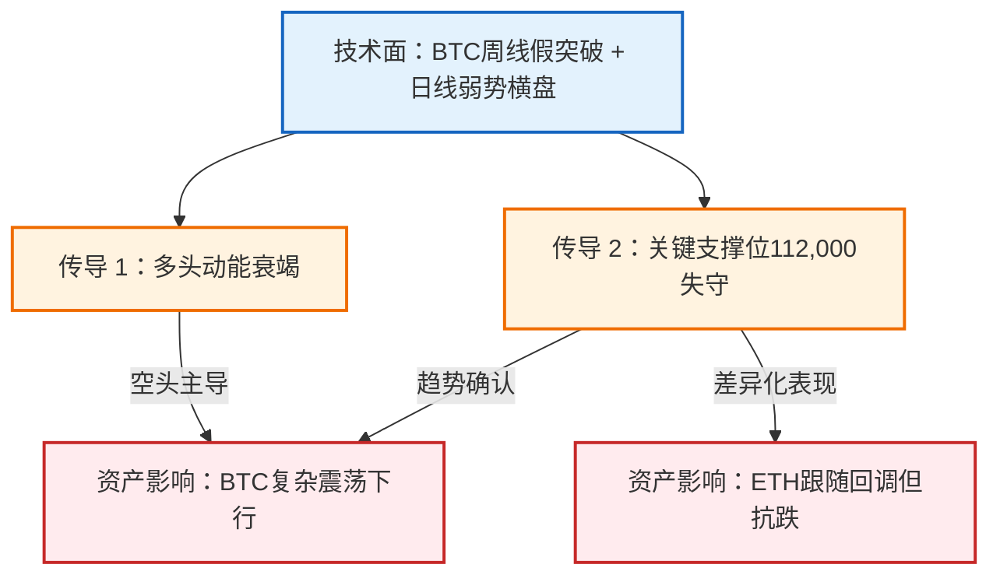

# 8月19日比特币最新行情分析，你想知道的都在这里

## 视频来源

https://www.bilibili.com/video/BV1rDYhzsEpr?p=1

## 总结

## 首席金融分析师

### 1. 研报摘要
- **讲座主题**：比特币与以太坊2025年8月技术面分析与交易策略
- **核心判断**：看空比特币（目标112,000以下），以太坊短期中性但需警惕周线级别转空
- **置信度/情绪**：**强烈看空比特币**/ 对以太坊保持**谨慎观望**

### 2. 宏观传导机制

### 3. 资产配置观点

| 资产类别 | 观点 | 核心逻辑摘要 | 关注位置 |
| --- | --- | --- | --- |
| **BTC/USDT** | 🔴 强烈看空 | 周线假突破+日线弱势横盘，目标112,000以下 | 跌破112,000加仓空单 |
| **ETH/USDT** | 🟡 中性偏多 | 4140-4150支撑区未破前保持低多 | 4574（第一目标） |
| **ETH风险点** | 🔴 突破失败 | 若跌破4109则转空，目标3500 | 周线吞没形态确认 |

### 4. 关键数据与证据
* **BTC关键位**：
  - 当前区间：112,000-116,700 USDT
  - 空单入场位：111,7800 USDT
  - 第一目标位：112,000 USDT
* **ETH关键位**：
  - 支撑位：4140-4157 USDT
  - 周线生死线：4109 USDT
  - 反弹目标：4574 USDT（斐波那契0.382-0.618）

### 5. 风险与不确定性
* **灰犀牛风险**：
  - BTC若在112,000形成插针反弹，可能触发空头回补
  - ETH大户突然砸盘导致支撑位失效
* **黑天鹅风险**：
  - 加密市场突发监管政策改变趋势
* **反向思考**：
  - 若BTC周线假突破后快速收复116,700，将形成牛市陷阱
  - ETH若在4140支撑区放量反弹，可能开启独立行情

大家上午好，今天是2025年8月19号上午11点44分，我们看到的是 **比特币**的盘面，我是交易员**K哥**。

今天我们一起来看一下行情发生了什么变化。昨天在更新周线级别的时候，已经跟大家明确讲过：这段 **多头** 的持续延续已经到了末端。接下来在未来半年内，估计都没有机会做一笔中长线的多单。相反，我们要在这个顶部位置寻找机会做空单，获取向下回调的利润。

那么我们来看一下日线。昨天更新视频的时候，也跟大家明确讲过，这三根K线在这里横盘，其实是一种非常弱势的表现。

那我们 **1117800**的空单目前还是正在持有当中。接下来今天的行情我们该怎么去做？如果你昨天有听了我的视频的话，应该很清楚。昨天给到大家一个非常重要的**支撑位**，大概是在这个区间，就前期这个**双顶** 的颈线处。

昨天跌到这里是有反弹的。如果你听了我的视频，可以在反弹过程中找机会。

见到弱势信号的时候做空的话，那我们的第一目标也跟大家说了，是在这个 **112000** 左右。

目前 **BTC/USDT永续**价格在112,000到116,700区间震荡。我们的空单仍在持续持有中**。这个地方是撑不住的**，很明确地告诉大家，这里无法形成有效支撑。

目前的话。

接近2000点的利润。我们看一下4小时图：从收了几根大阴线之后，目前的反弹都非常微弱。也就是说，**比特币**的盘面走势非常弱势。

这里可以看到一个水平高点。

前期的一个支阻互换的位置，这个位置也是我们昨天空单进场的位置。目前我们的第一目标是看到前期的底部，大概在 **112500**到**113000** 之间。

2000这个位置到这个位置的话，你的多单、空单肯定是要减持，该减持的减持，该止损的止损。这个地方是 **多头** 最后的一道防线，一定会有非常大的一个反应。

如果说这个地方没有很大的反应，直接带穿而过的话，它有极有可能会在 **110500到112000** 这个位置形成插针反抽，然后再收上去。

那如果说你想做这波反弹的话，怎么去做呢？很简单。你就等它这个行情耐心地来到下方。

如果没有跌破，形成了一个底部结构，那么右侧开始低点抬高的位置，就是 **进多单** 的位置。

如果直接带穿而过并跌破，需要观察何时站回。站回时一定要以 **阳线** 为主。一旦收阳线，这个位置也是多单进场的机会。

如果这是一笔反弹，我们吃了这个多单，理想的反弹区间可以关注 **0.618到0.382** 这个位置。

这个位置是我们潜在的一个 **交易预期**，这是做多的交易预期。

如果是做空的话，昨天已经说过了。如果你错过了前天和昨天这两波空单，现在就要耐心等待。有两种做法：

1. 要么它在这个地方直接带窗而过；

在这里反弹反抽迟迟站不上 **112000** 这个关口。此时做空单，继续向下看即可。

另一种情况是：如果在此处出现明显反弹，就需观察反弹区间及底部形成的 **多头结构** 极限扩展。

如果说在这个位置附近遇到前方的水平阻力位，它反弹不过，形成顶部反转信号，那这个位置就是你做空的位置。这是关于 **比特币** 的行情分析。

有人问，如果现在中长线持续看空，能看到多少？目前我们不敢讲太远，昨天在周线视频里已经跟大家讲清楚了。

大家有兴趣的话可以去听一下昨天的视频。

好，我们来看一下以太坊。昨天给到大家的操作建议是以 **低多** 为主，因为它的走势比大饼要健康很多。

从周线级别来看，目前只是一个正常的回踩。在没有实体跌破 **4109** 这个位置附近时，我们都不应该盲目看空以太坊。

当然，随着 **比特币**的回调，它也在有所回调。我们重点还是关注昨天提到的这个位置：**414**。

100到4157这个位置大概上下50点的空间。如果在这里形成跌破收回，配合 **比特币**有一个助力的动作，也可以介入**以太坊** 的多单。

在这里，A收回阳线并占回4150这一线时，就可以布局多单。那么这笔多单能吃到哪里？

1. **第一目标**看到这个位置，大概在4574；
2. 这是我们的一个交易预期。

但如果行情这样走：随着 **比特币**持续弱势**，以太坊** 大户持续砸盘，直接把这个位置一穿而过的话，那就要注意了。

这个时候你**以太坊**的一个多单就要注意，不要轻易去做了。因为我们看到**周线**级别，如果这个地方直接一穿而过的话，那么周线上它是收了一个大型的**吞没**，加上一个**上影线**这样一个组合。这是一个极度看跌的信号。

那我们至少要关注这一笔上涨所带来的回调区间。

那至少的话是在这个位置，3500左右。如果能给到，再加上这是前面一根大阳线的起点，我个人认为很难给到这个位置。

但如果给到机会的话，那将是我们中期布局 **以太坊** 多单的一个非常好的上车时机。

然后我们看一下 **以太坊**的短线。短线上，越靠近**4150-4170** 这一带的支撑位，越要考虑做多单。

什么时候它只要出现强势 **K线**，那你都可以尝试去做它的多单。当然，你不可能说我从一小时级别去做的单子，要去博弈前高突破，这个是不可能的。你是拿不住的。

另外一个，它就算是要反弹，要走反转去创新高的话，你最好……

最好的位置应该是要等右侧。我们可以很明显的看到在这一块。

有一条很明显的下降趋势线。如果以太坊在这里向下不破筑底的情况下，你在这个位置见到阳线，可以开一笔，等它反弹上去突破这个水平的 **阻力位**，同时突破趋势线并站稳。只要没有再跌回来，都可以在这个位置去右侧做一笔多单。

这是关于 **以太坊**的短线。今天的视频比较简单，我们按照昨天的逻辑来看：**长期看空以太坊和比特币****。比特币**在这一轮的上涨过程中，一直都没有出现非常像样的回调。从今年4月份开始，整体回调幅度是不够的。这一次它在这里筑紧之后，对前高形成了**假突破**。

一旦形成弱势，跌破这个 **112000** 的话，那么接下来我们就可以看到比特币一定会走一个复杂的震荡下行的调整。

那这个调整到位之后，我们是会有一笔非常

好的，做它的长线多单的一个准备。

但是这个机会估计至少在未来半年之内不会出现。也就是说，未来半年我们一直看 **比特币** 的持续震荡下行。

好吧，这是今天的一点个人观点，仅供参考，不做任何投资建议。谢谢大家。

