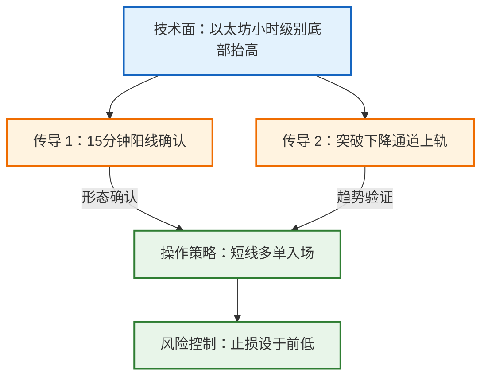

# 2025 8月19日 2

## 视频来源

https://www.bilibili.com/video/BV1iiewzKEC1?p=1

## 总结

## 首席金融分析师

### 1. 研报摘要
- **讲座主题**：以太坊短线交易策略分析
- **核心判断**：短线看多以太坊（4200以下支撑位），但中长线仍需等待4小时级别信号
- **置信度/情绪**：**谨慎看多**（短线机会明确，但强调严格止损和止盈纪律）

### 2. 宏观传导机制

### 3. 资产配置观点

| 资产类别       | 观点          | 核心逻辑摘要                                                                 | 操作建议                          |
|----------------|---------------|------------------------------------------------------------------------------|-----------------------------------|
| **以太坊(短线)** | 🟢 看多        | 小时级别底部抬高+15分钟阳线确认，下降通道内反弹                              | 4215附近多单，止损前低，目标通道上轨 |
| **以太坊(中线)** | 🟡 中性        | 4小时级别面临前高阻力+趋势线压制                                            | 需突破站稳后才能考虑中长线布局      |

### 4. 关键数据与证据
* **支撑位**：以太坊4200以下区间
* **形态指标**：
  - 小时级别底部抬高
  - 15分钟阳线确认信号
  - 下降通道上轨阻力位
* **对比数据**：以太坊反弹强度优于比特币

### 5. 风险与不确定性
* **灰犀牛风险**：
  - 下降通道上轨压制有效导致反弹失败
  - 比特币弱势拖累以太坊
* **操作风险**：
  - 短线交易周期错配（用小时信号做中长线）
  - 未严格执行止损/止盈纪律
* **反向思考**：
  - 若突破通道上轨并站稳，可能开启更大级别反弹
  - 需警惕假突破诱多陷阱

晚上好，今天是2025年8月19号晚上8点18分。晚上加入这个视频是想跟大家聊聊短线操作的问题。今天刚好有朋友问到，我个人平时做短线比较少。

在今天的视频里跟大家讲到的 **以太坊**，很明确地告诉大家不要去盲目追空。在4200以下，越靠近底部支撑区间，越要想办法做它的**多单**。

今天到晚上这个点的时候，**以太坊**这边反弹的比大饼要强势一点。

那么这个多单该怎么去做？我们从哪些方面去考虑？今天这期视频就跟大家好好聊一下。

首先，**短线交易**必须要把周期定好。

既然是短线，尽量控制在日内或者两天以内，我们称之为 **短线**。

短线具体交易区怎么做？我们以 **以太坊** 为例，按照早上的观点来讲：

1. 越靠近区间，越要想办法做多；
2. 短线上主要抓一些重要的 **结构性支撑** 和形态。

在这张图里可以看到，**比特币**自见顶后走出一个**假突破**，非常强势，也就是说多头反弹很弱势。

但是这个 **以太坊**，其实是走出了一个类似于通道的整理。

那目前它已经下午到了支撑位比较近的位置。这是短线我们去操作的，你会在这个比如像 **4215** 附近去买多吗？这个是不会的，短线交易不是这么做的。

首先我们来看一下短线交易，我今天提到给大家提到的两种做法。

第一个就是 **以太坊** 的价格持续下跌，在碰到支撑位附近形成一个相对的底部。然后，你看到它有底部抬高的迹象，这时候可以考虑做它的一个短多单。

首先，我们可以回到这个图里面。目前一小时级别上面，你可以看到底部是明显在抬高的。但这个时候你能在这个地方进吗？不行。怎么进呢？这里有两种做法：

1. 第一种是等待价格再次回踩，不破这边的低点，然后再上去，过了这个高点，你可以在这个地方选择做一笔多单。

那你的止损就放在这一线。

如果你想激进一点，可以在回调下来没有破这个低点的位置尝试。如果在更小级别（比如 **15分钟**）已经收了阳线，就可以在这个位置尝试操作。

止损也是放在这个地方。至于目标看到哪里，我们可以很明显看到这是一段下降通道。那你至少是看到它的通道上边界，大概就是在这个位置，也是前面的小时级别水平阻力位。

如果这个地方突破，回踩站稳了，没有再跌下去，那这个地方也是你 **右侧加仓** 的位置。或者说在这里重新开一个短多也可以。

既然是短线，有的小伙伴可能在问：我买到了相对来说比较好的价格位置。

如果说它一旦上去，我短线很早就走掉了，这怎么办？岂不是踏空。

这里我要给大家强调一个观点：**我们做交易，最重要的就是顺势和定周期**。既然我们选择的是一小时周期？

在你有盈利之后，一定要想办法先止盈一部分，或者做 **成本保护**。

如果它能涨上去，你有剩余的仓位可以继续吃肉。如果跌下来，你至少不会亏损你的本金。

如果说我想做一笔长线的多单，中长线的多单。

以太坊这个位置合适吗？我们来看一下4小时级别。可以很明确地告诉大家：如果你今晚选择在这里，或者等一个机会做短线上去，想博弈更多 **多头** 的持续延续——好博弈吗？

我个人觉得概率不大。既然定义的是 **一小时级别**，那在短线级别上吃到的肉就要及时落袋为安。如果想做一笔**中长线**的单子，至少要以**4小时信号** 为准去入场。

这个地方很明显，如果上去之后：

1. 首先面临前高阻互换位置的压力；
2. 又有趋势线的压力。

在这个位置，你能拿长线多单吗？肯定不可以。那什么时候可以呢？假如我们不去预测行情，但必须知道：**如果行情怎么走，心里要有对应的计划**。

这叫交易预期，这叫计划。你的交易。

假如这个地方回踩之后，小时级别收阳线或者更小级别收阳线，你多单开进去了。在这个位置你肯定要止盈一部分，甚至大部分止盈。止盈完之后，如果真的突破站上了，这个时候再加回来也不迟，不至于踏空一整段行情。

这就是今天晚上对 **以太坊**的解读，也借此跟大家聊一下短线上的一些**交易逻辑** 和思维。不做任何投资建议，仅供参考。谢谢大家，再见。

